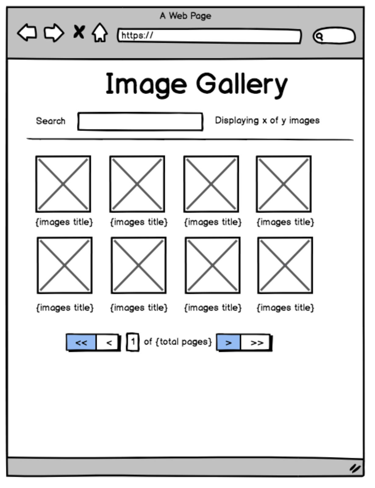
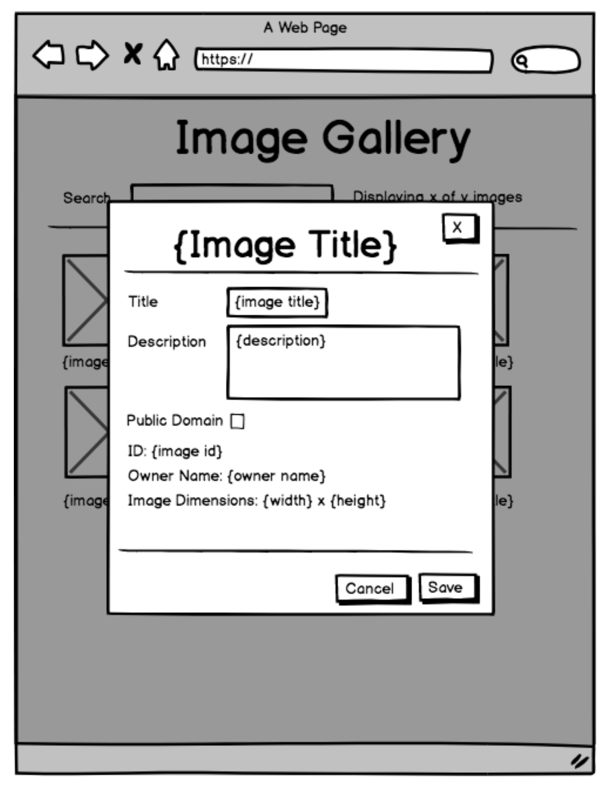

# Image gallery requirements

The image gallery isn't complete. Although it shows a lot of the imagery we have, it's hard to sift through and hard to see the details of all the images. We need to polish up the product so users can find what they're looking for more easily. The following wireframes show what we're aiming for:

 

## Features

We've already vetted some of the features our users are asking for. Based on observations from our user interviews, we want to enable users to:

- Click an image thumbnail to see the full image and more details about the image. When the modal is open, edit some of the details and save the changes or cancel.
- Search for images whose title or description match the entered text.
- Paginate through the images and select the number of results to show per page. Move one page forward or back at a time, or go to the first or last page.

> **Note**
> You can use components and functionality from the [Pharos design system](https://pharos.jstor.org) to accomplish these features.

> **Note**
> You can and should extend any of the frontend and backend interaction to best model your needs.

## Code

We want to make sure the codebase remains manageable as we develop these features. The `App.tsx` component is already a little bit overgrown, so we should improve that as we go along.
